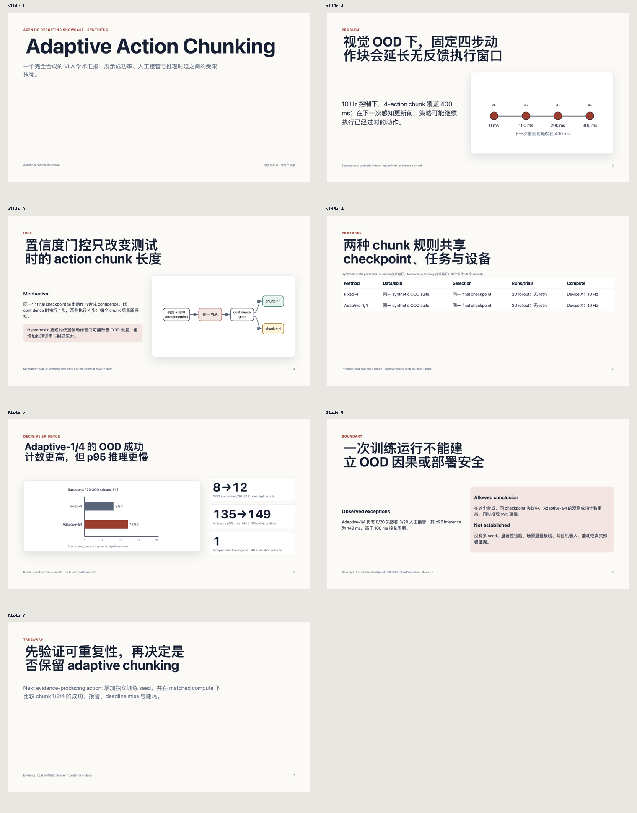
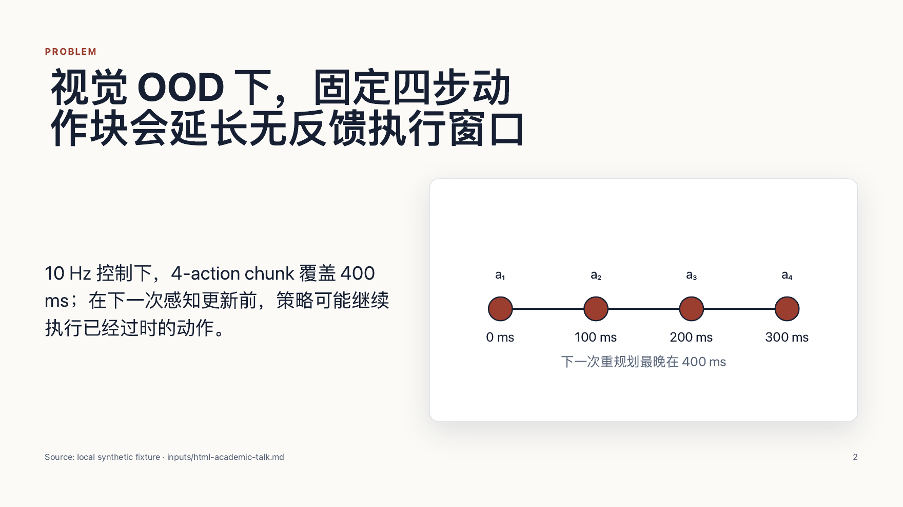
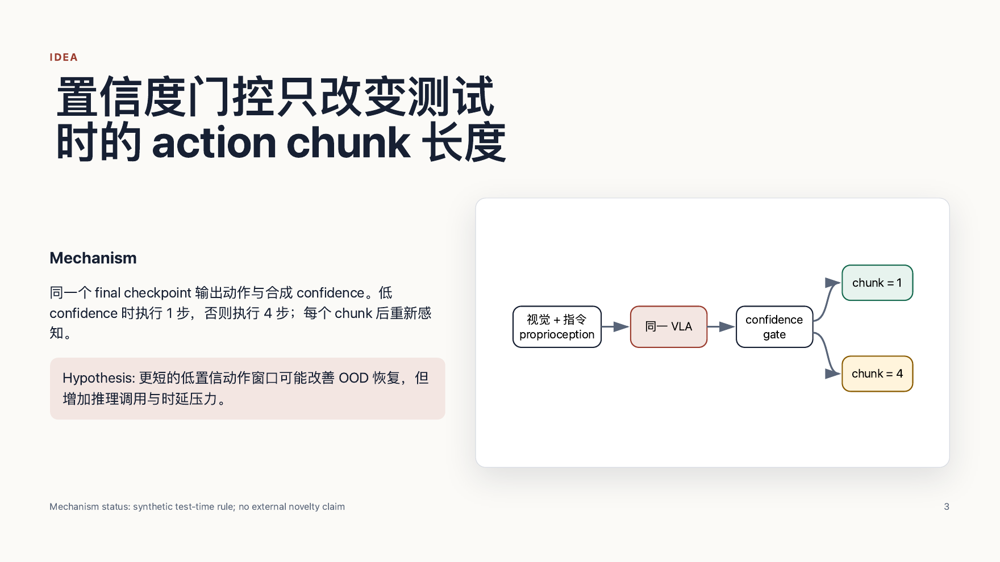
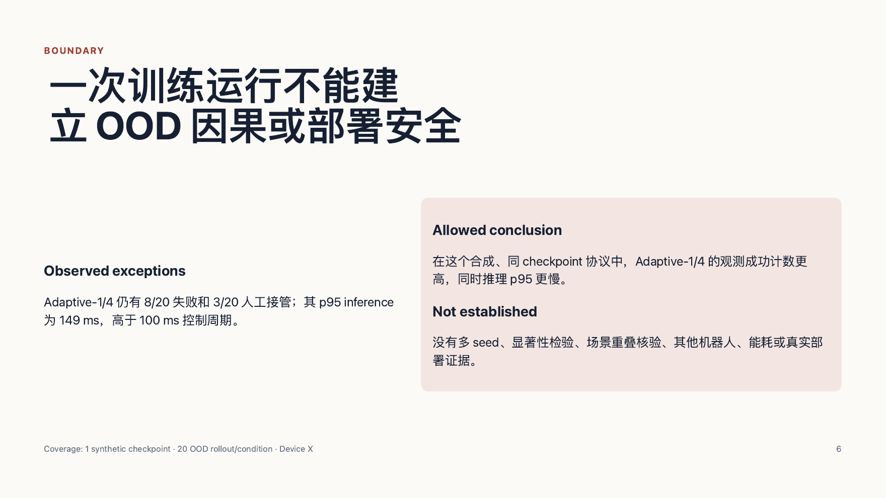

# Super Agent Presentation

**An agent-native reporting framework: scenario-adaptive report protocols, bounded
context routing, checkpointed long-task memory, and mechanical structural audits —
so the same task handed to an agent stops producing a different, unreadable report
every time.**

[](https://github.com/asimfish/super_agent_presentation/actions/workflows/ci.yml)
[](https://github.com/asimfish/super_agent_presentation/releases)
[](https://asimfish.github.io/super_agent_presentation/)
[](LICENSE)
[](.github/workflows/ci.yml)
[](README_CN.md)

*Works with Claude Code, Codex, Cursor, and GitHub Copilot via
[host adapters](adapters/), or with any agent that can read one Markdown index
([link-only mode](AGENT_START.md)).*

<p align="center">
  <a href="examples/showcase-20260825/render/academic-talk.pdf">
    
  </a>
</p>
<p align="center"><em>A real output: 7-page academic deck built from the <code>academic-talk-html</code> template and printed through real Chrome — one of <a href="examples/README.md">16 finished examples with full audit receipts</a>. <a href="https://asimfish.github.io/super_agent_presentation/deck.html">Open it live</a> or browse the <a href="https://asimfish.github.io/super_agent_presentation/">demo page</a>.</em></p>

<details>
<summary><b>Page previews</b> — Chrome-printed renders of the same deck (long CJK titles, tables, boundary pages)</summary>

<table><tr>
<td width="33%"><a href="https://asimfish.github.io/super_agent_presentation/deck.html"></a></td>
<td width="33%"><a href="https://asimfish.github.io/super_agent_presentation/deck.html"></a></td>
<td width="33%"><a href="https://asimfish.github.io/super_agent_presentation/deck.html"></a></td>
</tr></table>

</details>

## Why

Give an agent the same substantive task twice and you get two differently shaped
reports; some are unreadable for humans. Style guides alone do not survive long
tasks: after hours of work and context compaction, the agent has forgotten the
reporting contract, and a giant "always follow this template" prompt taxes every
turn and flattens short answers and deep experiment reports into the same shape.

This framework treats reporting as a routed, checkpointed, auditable protocol
instead of a style preference. Whatever the wording, a reader should reliably
find:

> answer or status → evidence → explanation → boundaries or uncertainty → useful next step

Short answers may stay one sentence. Experiment reports must carry protocol,
metrics, run counts, uncertainty, tables, and conclusion boundaries. An explicit
user-requested format (JSON, three sentences, a paper section) always wins.

## What you get

- **12 primary report modes** — concise answer, implementation handoff, status
  update, investigation, experiment report, research idea, decision brief, risk
  report, incident update, postmortem, academic synthesis, review report.
- **8 display modules** — visuals, tables, conclusions, evidence, academic-paper
  presentation, ablation design, performance benchmarking, natural tone (a
  fact-preserving de-AI pass) — loaded only when the report needs them.
- **4 bounded research profiles** — reinforcement learning, embodied AI, world
  models, VLA — domain protocol cards without hardcoding any benchmark's habits.
- **12 exact template assets** — detailed experiment reports per domain,
  paper-idea brief, dependency-free HTML/PPT-style academic deck, Quarto
  Reveal.js source, SBAR handoff, executive one-pager, reviewer response, and
  model/dataset release card — retrieved one at a time, never bundled into
  context.
- **A stdlib-only CLI** (`reportctl`) that routes, bundles bounded context,
  checkpoints long tasks, scaffolds, audits structure mechanically, and renders a
  strict JSON report IR.
- **Anti-forgetting for long tasks** — a tiny persistent micro-contract, a small
  on-disk checkpoint saved at task start, and a final audit driven by the same
  checkpoint file, so the reporting contract survives context compaction.
- **Evidence-first culture** — audits check structure mechanically; the repository
  never claims your facts are correct, and it does not claim measured quality
  gains it has not measured (see [Evidence status](#evidence-status)).
- **Absorbed reporting standards** — 30+ named sources (ASA p-value statement,
  CONSORT/PRISMA accounting, benchmarking-crimes literature, error-bar and
  uncertainty-visualization research, model cards and datasheets, peer-review
  response norms) encoded into modes, modules, and templates, with every mapping
  auditable in [docs/REPORTING-STANDARDS.md](docs/REPORTING-STANDARDS.md).

## Quick start

### Fastest trial (no install)

Paste this together with the repository link into your agent:

```text
请先读取该仓库的 AGENT_START.md，并用其中的最小路由完成本次最终汇报；
不要读取全部协议。仓库：https://github.com/asimfish/super_agent_presentation
```

Or use the English bootstrap prompt in [AGENT_START.md](AGENT_START.md). Link-only
mode is best-effort; installation is the persistent path.

### Install into a project

```bash
git clone https://github.com/asimfish/super_agent_presentation.git
cd super_agent_presentation
python3 scripts/install.py plan  --target /path/to/your/project --host codex   # preview
python3 scripts/install.py apply --target /path/to/your/project --host codex   # apply
```

`--host claude`, `--host cursor`, and `--host copilot` are also supported. The
installer never overwrites existing Skills or instruction files; see
[INSTALL.md](INSTALL.md).

### The agent workflow

```bash
python3 skills/agentic-reporting/scripts/reportctl.py list
python3 skills/agentic-reporting/scripts/reportctl.py bundle \
  --task "Report a five-seed RL ablation" \
  --mode experiment-report --profile reinforcement-learning --module tables
python3 skills/agentic-reporting/scripts/reportctl.py audit \
  --file report.md --mode experiment-report --strict
```

For a long task, save a checkpoint near the start, work freely, then let the final
audit read the same checkpoint:

```bash
python3 skills/agentic-reporting/scripts/reportctl.py checkpoint \
  --task "Report implementation results, verification, remaining risk" \
  --mode implementation-handoff --surface chat \
  --must-show "Verification evidence" \
  --output <private-scratch>/agent-report.json

python3 skills/agentic-reporting/scripts/reportctl.py audit \
  --file report.md --checkpoint <private-scratch>/agent-report.json --strict
```

## Real examples

[`examples/showcase-20260825/`](examples/README.md) holds one finished sample for
every mode and profile — generated through the real CLI workflow with every
receipt preserved, final verdict **ALL PASS** (16/16 strict audit, 16/16 semantic
oracle, 7/7 manual page review).

| See | Where |
|---|---|
| 12 core-mode reports (Chinese samples) | [`examples/showcase-20260825/modes/`](examples/showcase-20260825/modes/) |
| 4 research-profile reports (RL / embodied / world models / VLA) | [`examples/showcase-20260825/profiles/`](examples/showcase-20260825/profiles/) |
| 7-page academic HTML deck + Chrome-printed PDF | [`html/deck.html`](examples/showcase-20260825/html/deck.html) · [`render/academic-talk.pdf`](examples/showcase-20260825/render/academic-talk.pdf) |
| Every first-attempt failure and its fix, kept honestly | [`first-failures.md`](examples/showcase-20260825/first-failures.md) |
| Machine-readable manifest binding reports to receipts | [`manifest.json`](examples/showcase-20260825/manifest.json) |

All example facts are synthetic fixtures; rendering was verified on macOS Chrome
151 only. Details and boundaries in [examples/README.md](examples/README.md).

## How it survives long tasks



```mermaid
flowchart LR
    accTitle: Three-layer execution mechanism of agentic reporting
    accDescr: A tiny resident contract saves a small checkpoint at long-task start and releases the detailed protocol; at delivery it reloads one primary protocol, at most two modules, and audits with the same checkpoint.
    A[Resident micro-contract] --> B{Likely long task?}
    B -- yes --> C[Route briefly, save tiny checkpoint]
    C --> D[Release detailed protocol]
    B -- no --> E[Do the task]
    D --> E
    E --> F[Reporting boundary]
    F --> G[Reload checkpoint or pick one primary protocol]
    G --> H[Research task: at most one domain profile]
    H --> K[Prefer one display module, max two]
    K --> L[Surface guide only when needed; template assets stay out of bundles]
    L --> I[Audit with the same checkpoint, verify facts]
    I --> J[Final report]
```

- The resident layer only decides *when* to activate; it never keeps the manual in
  context.
- Progressive disclosure loads one primary protocol, at most one research profile,
  and bounded modules — measured context budgets in
  [docs/CONTEXT-BUDGET.md](docs/CONTEXT-BUDGET.md).
- Prompt layers reduce forgetting; they cannot mechanically block a bad delivery.
  For that, wrap `checkpoint` + final `audit --checkpoint` exit codes in CI or a
  wrapper.

## Catalog

12 modes · 7 display modules · 4 research profiles · 5 surfaces · 12 exact
templates — the full inventory with per-item summaries, bounded route files, and
finished-example links lives in [docs/CATALOG.md](docs/CATALOG.md).

| Research/display need | Asset or profile | Enforced emphasis |
|---|---|---|
| General experiment | `experiment-report-detailed` | claim map, protocol, metric direction, run counts, uncertainty, reproducibility |
| Paper idea | `research-idea` mode + template | limitation, hypothesized mechanism, recent work, decisive experiment, falsifiers, kill criterion |
| Reinforcement learning | `reinforcement-learning` / `rl-experiment-report` | env steps, runs/seeds, tuning parity, learning curves, interval estimates, failed tasks |
| Embodied AI | `embodied-ai` / `embodied-experiment-report` | sim vs real, robot and sensors, success rule, resets/interventions, generalization axes, failure types |
| World models | `world-models` / `world-model-experiment-report` | model/data cards, open-loop prediction, closed-loop control, scaling, exploitation boundary |
| VLA | `vla` / `vla-experiment-report` | data mixture, embodiment and action interface, rollouts, generalization, latency, safety |
| HTML/PPT academic talk | `academic-talk-html` | dependency-free, responsive, printable, keyboard nav, assertion-evidence pages |
| Quarto slides | `academic-talk-revealjs` | Reveal.js, citations, speaker notes, self-contained HTML, appendix |
| Ablation study | `ablation` module | variant-versus-full-system comparison, interaction checks, tuning-policy parity, honest contribution tables |
| Performance comparison | `benchmarking` module | full-suite protocol, geometric/harmonic means, speedup and tail-latency discipline, platform disclosure |
| De-AI tone pass | `natural-tone` module | fidelity contract (facts, relations, scope survive rewriting), signal-to-action table for CN/EN boilerplate, misfire protection for technical vocabulary |
| Reviewer response | `rebuttal-response` | point-by-point quoting, outcome-first replies, precise revision locations, no unverifiable promises |
| Model/dataset release | `release-card` | identity and license, intended use, provenance with exclusion accounting, disaggregated evaluation, limitations |

## Deployment and constraint ladder

| Usage | Fits | Constraint strength |
|---|---|---|
| Send the repo URL to the agent | quick trial | best-effort; a URL is not an install and does not raise instruction priority |
| Explicit `$agentic-reporting` invocation | one-off task with the Skill installed | medium |
| Installed Skill + host micro-contract | daily cross-task use | recommended; the host keeps reminding the finalization flow |
| Same-checkpoint audit + external wrapper/CI | long tasks, batch delivery | mechanically blockable by exit code; still does not verify facts |
| JSON IR + validator/renderer | APIs, durable formal reports | strongest structural constraint; does not replace evidence checking |

For formal reports, start from
`skills/agentic-reporting/assets/templates/report-spec.json`, then
`validate-spec → render → audit --strict`. The JSON IR separates `verified` /
`inference` / `recommendation` claims and requires verified conclusions to cite
evidence IDs. Details in [README_CN.md](README_CN.md#正式报告的-strict-path) and
[docs/ARCHITECTURE.md](docs/ARCHITECTURE.md).

## Evidence status

This repository practices what it preaches: **it does not claim measured
effectiveness it does not have.** A minimal one-case Codex pilot observed the
treatment agent reading the Skill and passing machine checks (baseline 9/10,
framework 10/10), but with one public case, one unpinned model revision, and one
repetition it is permanently marked `insufficient_evidence` — no quality,
readability, or efficiency gain is claimed. The preregistered study pipeline,
blinding, and claim gates that a real effectiveness claim would require are
implemented and documented in [BENCHMARK.md](BENCHMARK.md) and
[evals/](evals/README.md).

What *is* verified: deterministic routing, bounded bundles, checkpoint/audit
mechanics, template rendering (306 unit tests + harness smoke + real-render
regression on macOS Chrome 151), and the end-to-end showcase run with receipts in
[examples/](examples/README.md).

## Repository structure

```text
AGENT_START.md                 # smallest bootstrap for link-only agents
AGENTS.md                      # resident micro-contract for this repo
adapters/                      # Claude, Codex, Cursor, Copilot host adapters
skills/agentic-reporting/
  SKILL.md                     # routing and finalization workflow
  references/                  # core, primary modes, display modules
  assets/templates/            # exact Markdown/JSON structure guards
  assets/presentations/        # HTML/Quarto academic deck templates
  scripts/reportctl.py         # route/bundle/checkpoint/audit/render CLI
dist/                          # prebuilt link-only route bundles
examples/showcase-20260825/    # 16 finished reports + deck + audit receipts
evals/                         # study schemas, templates, sanitized run records
scripts/                       # installer, benchmark harness, study controller
docs/                          # architecture, research, catalog, ADRs
tests/                         # 306 unit tests
```

## Verification

```bash
python3 scripts/check_test_env.py               # preflight: cloud-sync/eviction hazards
python3 -m pip install -r requirements-dev.txt
python3 -m unittest discover -s tests -v
python3 scripts/presentation_benchmark.py smoke
```

The preflight warns when the clone sits in a cloud-synced folder (iCloud
Desktop/Documents included) and fails when file content has been evicted —
both make the subprocess-heavy tests hang or flake.

`smoke` validates known-good/bad fixtures and routing and prints
`host_activation_observed: false` — it calls no real host or model.

## Design docs

[Architecture](docs/ARCHITECTURE.md) · [Catalog](docs/CATALOG.md) ·
[Research sources](docs/RESEARCH.md) · [Template provenance](docs/TEMPLATE-SOURCES.md) ·
[Reporting standards](docs/REPORTING-STANDARDS.md) ·
[Context budgets](docs/CONTEXT-BUDGET.md) · [Performance](docs/PERFORMANCE.md) ·
[Security review](docs/SECURITY-REVIEW.md) · [Benchmark protocol](BENCHMARK.md) ·
[Security policy](SECURITY.md) · [ADRs](docs/adr/)

## Contributing

See [CONTRIBUTING.md](CONTRIBUTING.md). The short version: run the full test
suite, keep `dist/` reproducible, and never add an effectiveness claim without
the evidence gates in [BENCHMARK.md](BENCHMARK.md).

## Citation

If this framework is useful in your work, cite it via
[CITATION.cff](CITATION.cff) (GitHub's "Cite this repository" button) or:

```bibtex
@software{super_agent_presentation,
  author  = {asimfish},
  title   = {Super Agent Presentation: an agent-native reporting framework},
  year    = {2026},
  version = {0.6.0},
  url     = {https://github.com/asimfish/super_agent_presentation}
}
```

## License

MIT — see [LICENSE](LICENSE).
