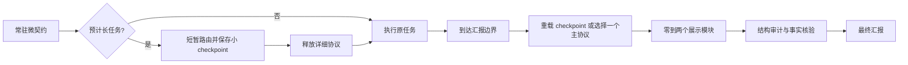

# Super Agent Presentation

一套给 Agent 使用的、场景自适应的汇报框架。它为长任务、实验、图片、
表格、论文、故障、决策和代码交付提供可复用的语义骨架，同时避免所有回答
都被塞进同一个大模板；实际遵循程度仍取决于宿主和模型。

当前版本是 `v0.1.0` 候选版。14 份正负 fixture、7 个场景路由和 5 个
post-activation 路由代理均达到声明预期；3 组 fresh-agent 开发测试保留了
失败迭代与最终门禁。这些都不是真实宿主激活率或人类盲评，因此本仓库
不宣称已经测得“提升了 Agent 输出质量”。

## 它解决什么

同一任务多次交给 Agent，文字可以不同，但读者至少应稳定找到：

> 答案或状态 → 证据 → 解释 → 边界或不确定性 → 有用的下一步

框架不会强制每一项都变成标题。短答可以只有一句话；实验汇报则会要求
协议、指标、运行次数、不确定性、表格和结论边界。用户明确指定的 JSON、
三句话、论文格式或其他表面始终优先。

## 如何降低长任务后的遗忘风险



- 常驻层只负责“何时调用”，不加载完整手册。
- Skill 通过渐进式披露一次只取一个主协议和最多两个展示模块。
- 长任务把少量汇报意图保存为 checkpoint，最终阶段从磁盘重新加载，
  降低仅依赖早期对话记忆而遗忘的风险。
- 审计器检查可机械判断的结构错误；事实、科学结论和证据仍需人工或领域
  工具核验。

## 部署与约束层级

| 使用方式 | 适用场景 | 约束强度 |
|---|---|---|
| 只把仓库 URL 发给 Agent | 临时试用 | 尽力遵循；URL 不会自动安装或提升指令优先级 |
| 显式调用 `$agentic-reporting` | 已安装 Skill 的单次任务 | 中等 |
| 安装 Skill + 宿主微契约 | 日常跨任务使用 | 推荐；宿主会持续提醒最终化流程 |
| 微契约 + Skill + JSON IR + validator/renderer | 批量、API、正式报告 | 结构约束最强，但仍不保证事实为真 |

## 最快试用

如果暂时不安装，把仓库链接和下面这句话一起交给 Agent：

```text
请先读取该仓库的 AGENT_START.md，并用其中的最小路由完成本次最终汇报；
不要读取全部协议。仓库：https://github.com/asimfish/super_agent_presentation
```

这只是 link-only 模式。想让宿主在长任务开始和交付时持续提供提醒，推荐安装。

## 安装到项目

先克隆本仓库，然后只读预览安装动作：

```bash
git clone https://github.com/asimfish/super_agent_presentation.git
cd super_agent_presentation
python3 scripts/install.py plan \
  --target /absolute/path/to/your/project --host codex
```

确认后执行：

```bash
python3 scripts/install.py apply \
  --target /absolute/path/to/your/project --host codex
```

可重复传入 `--host claude`、`--host cursor` 或 `--host copilot`。安装器不会
替换已有 Skill；已有指令文件默认保持字节不变并提示手动合并。只有显式增加
`--append-adapter` 才会先备份、再追加带标记的微契约。完整说明见
[INSTALL.md](INSTALL.md)。

## Agent 的标准工作流

Skill 位于 `skills/agentic-reporting/`。Agent 应把 `<skill-dir>` 解析为该目录：

```bash
python3 <skill-dir>/scripts/reportctl.py list
python3 <skill-dir>/scripts/reportctl.py bundle \
  --task "汇报五次独立运行的实验结果" \
  --mode experiment-report --module tables --module conclusions
python3 <skill-dir>/scripts/reportctl.py audit \
  --file report.md --mode experiment-report
```

预计为长任务时，应在开始阶段只保存一个小 checkpoint，任务期间释放详细
bundle，交付前再加载：

```bash
python3 <skill-dir>/scripts/reportctl.py checkpoint \
  --task "汇报实现结果、验证和剩余风险" \
  --mode implementation-handoff --surface chat \
  --output .agent-report.json

python3 <skill-dir>/scripts/reportctl.py bundle \
  --checkpoint .agent-report.json
```

## 覆盖的主场景

- 简短直接回答
- 实现或代码交付
- 项目状态更新
- 调研与故障诊断
- 实验与消融分析
- 决策与风险
- 论文或文献综合
- 审查与审计
- 进行中的 incident
- 事后复盘

图片、图表、表格、结论、证据和学术展示作为正交模块按需加入，不是每份
汇报的固定装饰。

## 正式报告的 strict path

批量 Agent 或正式实验报告可从
`skills/agentic-reporting/assets/templates/report-spec.json` 开始。JSON 中显式
区分 `verified`、`inference` 和 `recommendation`，使用 `roles` 标记 claim
覆盖的语义位，并让已验证结论引用 evidence ID。validator 会从当前
协议目录读取每个 mode 的必备语义；例如 postmortem 缺少 impact、timeline
或 cause 会直接失败。随后：

```bash
python3 skills/agentic-reporting/scripts/reportctl.py validate-spec \
  --file report.json
python3 skills/agentic-reporting/scripts/reportctl.py render \
  --file report.json --output report.md
python3 skills/agentic-reporting/scripts/reportctl.py audit \
  --file report.md --mode implementation-handoff --strict
```

JSON 是展示层的单一真源；原始日志、论文、测试或数据仍是事实真源。
随附 JSON Schema 只用于可移植的结构与条件预检；正式渲染前必须以
`validate-spec` 为准，因为 evidence ID 唯一性、跨记录引用和当前协议语义
无法全部由独立 JSON Schema 表达。

## 仓库结构

```text
AGENT_START.md                 # 给 link-only Agent 的最小入口
AGENTS.md                      # 本仓库常驻微契约
adapters/                      # Claude、Cursor、Copilot 等宿主适配
skills/agentic-reporting/
  SKILL.md                     # 路由与最终化工作流
  references/                  # 核心、主模式与展示模块
  assets/templates/            # Markdown 与 JSON 结构守卫
  scripts/reportctl.py         # route/bundle/checkpoint/audit/render
dist/                          # 无 CLI 时的一文件路由包
evals/                         # 激活与输出质量评测用例
scripts/presentation_benchmark.py
docs/adr/                      # 架构决策记录
```

## 验证

```bash
python3 -m pip install -r requirements-dev.txt
python3 -m unittest discover -s tests -v
python3 scripts/presentation_benchmark.py smoke
```

`smoke` 验证已知好/坏 fixture、场景路由和正例进入 Skill 后的路由代理。
它明确输出 `host_activation_observed: false`：未调用真实宿主或模型。开发期
fresh-agent 记录见 [evals/runs/forward/README.md](evals/runs/forward/README.md)。真实
效果声明所需的隔离基线、长上下文压力、盲评与统计门槛见
[BENCHMARK.md](BENCHMARK.md)。

## 设计与来源

架构取舍见 [docs/ARCHITECTURE.md](docs/ARCHITECTURE.md)，官方资料与独立综合
边界见 [docs/RESEARCH.md](docs/RESEARCH.md)，畸形 Markdown 的性能回归证据见
[docs/PERFORMANCE.md](docs/PERFORMANCE.md)。本仓库没有复制限制性第三方模板或
视觉资产。

## License

MIT，见 [LICENSE](LICENSE)。
