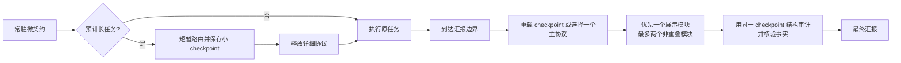

# Super Agent Presentation

一套给 Agent 使用的、场景自适应的汇报框架。它为长任务、实验、图片、
表格、论文、故障、决策和代码交付提供可复用的语义骨架，同时避免所有回答
都被塞进同一个大模板；实际遵循程度仍取决于宿主和模型。

当前版本为 `v0.3.0`。除 14 份正负 fixture、7 个场景和 5 个
post-activation 路由代理外，本版新增了预注册、生成记录、真实宿主计划、
显式执行、盲化、独立评分冻结和成对汇总流水线。一次最小 Codex pilot
观察到 treatment 读取了 Skill，baseline/framework 分别通过 9/10 与 10/10
机器检查；但它只有一个公开 case、一个未固定 revision 的模型和一次重复，
且 framework 输出从 358 增至 980 tokens。因此该 pilot 永久标记为
`insufficient_evidence`，本仓库不宣称已经测得质量、可读性或效率提升。

## 它解决什么

同一任务多次交给 Agent，文字可以不同，但读者至少应稳定找到：

> 答案或状态 → 证据 → 解释 → 边界或不确定性 → 有用的下一步

框架不会强制每一项都变成标题。短答可以只有一句话；实验汇报则会要求
协议、指标、运行次数、不确定性、表格和结论边界。用户明确指定的 JSON、
三句话、论文格式或其他表面始终优先。

## 如何降低长任务后的遗忘风险



- 常驻层只负责“何时调用”，不加载完整手册。
- Skill 通过渐进式披露一次只取一个主协议，优先一个展示模块，最多加入
  两个不重叠模块。实验模式已内含结论纪律，不会因用户写了“结论”而重复
  加载通用结论模块。
- 长任务把少量汇报意图保存为 checkpoint，最终阶段从磁盘重新加载并以
  同一 checkpoint 审计，降低仅依赖早期对话记忆而遗忘的风险。
- 审计器检查可机械判断的结构错误；事实、科学结论和证据仍需人工或领域
  工具核验。

这些 prompt 层只能降低遗忘风险。要机械阻断不合格交付，需由外部 wrapper 或 CI
强制“创建 checkpoint 成功，且最终 `audit --checkpoint` 返回 0”；本仓库不宣称 prompt
本身能做到强制。

## 部署与约束层级

| 使用方式 | 适用场景 | 约束强度 |
|---|---|---|
| 只把仓库 URL 发给 Agent | 临时试用 | 尽力遵循；URL 不会自动安装或提升指令优先级 |
| 显式调用 `$agentic-reporting` | 已安装 Skill 的单次任务 | 中等 |
| 安装 Skill + 宿主微契约 | 日常跨任务使用 | 推荐；宿主会持续提醒最终化流程 |
| 同一 checkpoint 审计 + 外部 wrapper/CI | 长任务、批量交付 | 可按退出码机械阻断；仍不验证事实 |
| JSON IR + validator/renderer | API、持久化正式报告 | 提供更强结构约束；不代替证据核验 |

## 最快试用

如果暂时不安装，把仓库链接和下面这句话一起交给 Agent：

```text
请先读取该仓库的 AGENT_START.md，并用其中的最小路由完成本次最终汇报；
不要读取全部协议。仓库：https://github.com/asimfish/super_agent_presentation
```

这只是 link-only 模式。想让宿主在长任务开始和交付时持续提供提醒，推荐安装。

## 安装到项目

先克隆本仓库，然后只读预览安装动作：

```bash
git clone https://github.com/asimfish/super_agent_presentation.git
cd super_agent_presentation
python3 scripts/install.py plan \
  --target /absolute/path/to/your/project --host codex
```

确认后执行：

```bash
python3 scripts/install.py apply \
  --target /absolute/path/to/your/project --host codex
```

可重复传入 `--host claude`、`--host cursor` 或 `--host copilot`。安装器不会
替换已有 Skill；已有指令文件默认保持字节不变并提示手动合并。只有显式增加
`--append-adapter` 才会先备份、再追加带标记的微契约。完整说明见
[INSTALL.md](INSTALL.md)。

## Agent 的标准工作流

Skill 位于 `skills/agentic-reporting/`。Agent 应把 `<skill-dir>` 解析为该目录：

```bash
python3 <skill-dir>/scripts/reportctl.py list
python3 <skill-dir>/scripts/reportctl.py bundle \
  --task "汇报五次独立运行的实验结果" \
  --mode experiment-report --module tables
python3 <skill-dir>/scripts/reportctl.py audit \
  --file report.md --mode experiment-report
```

预计为长任务时，应在开始阶段只保存一个小 checkpoint，任务期间释放详细
bundle，交付前再加载，并让最终审计使用同一文件：

```bash
python3 <skill-dir>/scripts/reportctl.py checkpoint \
  --task "汇报实现结果、验证和剩余风险" \
  --mode implementation-handoff --surface chat \
  --must-show "Verification evidence" \
  --output <private-scratch>/agent-report.json

python3 <skill-dir>/scripts/reportctl.py bundle \
  --checkpoint <private-scratch>/agent-report.json
python3 <skill-dir>/scripts/reportctl.py audit \
  --file report.md --checkpoint <private-scratch>/agent-report.json --strict
```

v2 的 `must-show` 只在空行分隔、column-zero 的纯顶层 Markdown 正文段落中
计分；含 heading、quote、list、table、link/reference、image、code 或 raw HTML
的段落不计分。为避免伪装解析跨段 DOM/CSS 状态，首个未屏蔽的 raw HTML tag
之后停止所有锚点计分，而 raw HTML 本身也是结构审计错误。每个锚点必须各自
在同一个安全段落内命中；段内软换行会折叠为空格，但不能跨空行拼接。报告代理会先按
共享 scanner 支持的、以分号结尾的 CommonMark entity 子集解码一轮，但只解码
`&` 前面不是奇数个反斜线的 entity；然后再做 NFC、大小写折叠和空白折叠。解码后出现 control
或 Unicode 非显示字符会使门禁失败。v2 锚点必须是 exact rendered plain
text，且不能使用 Markdown delimiter 形式。它不是语义或事实验证。建议把每个短锚点
放入 raw HTML 之前的一条独立普通结论句；单项最多 120 字符，转义后连同分隔符的总预算最多
240 字符。checkpoint 会原样保存任务、
受众和锚点；应放在版本控制之外的私有临时目录，且注意 `route`/`bundle`
可能把这些文本输出到日志。v1 文件仍可供 `route`/`bundle` 读取，但不能
驱动最终审计。bundle 的 `--max-chars=16000` 是独立的上下文预算；某些合法
的双模块组合需要调用者显式提高它。`audit --checkpoint` 的报告输入上限
是 1 MiB；其中任一可计分普通正文段落最多 4096 字符，连续 Unicode mark
最多 64 个，超限段落会产生错误且不会进入 NFC 或锚点匹配。仅用 `--mode`
的旧路径仍为 4 MiB。所有受限 JSON 输入还会在数值转换前拒绝超过 128
字符的 integer/float token。

## 覆盖的主场景

- 简短直接回答
- 实现或代码交付
- 项目状态更新
- 调研与故障诊断
- 实验与消融分析
- 决策与风险
- 论文或文献综合
- 审查与审计
- 进行中的 incident
- 事后复盘

图片、图表、表格、结论、证据和学术展示作为正交模块按需加入，不是每份
汇报的固定装饰。

## 正式报告的 strict path

批量 Agent 或正式实验报告可从
`skills/agentic-reporting/assets/templates/report-spec.json` 开始。JSON 中显式
区分 `verified`、`inference` 和 `recommendation`，使用 `roles` 标记 claim
覆盖的语义位，并让已验证结论引用 evidence ID。validator 会从当前
协议目录读取每个 mode 的必备语义；例如 postmortem 缺少 impact、timeline
或 cause 会直接失败。随后：

```bash
python3 skills/agentic-reporting/scripts/reportctl.py validate-spec \
  --file report.json
python3 skills/agentic-reporting/scripts/reportctl.py render \
  --file report.json --output report.md
python3 skills/agentic-reporting/scripts/reportctl.py audit \
  --file report.md --mode implementation-handoff --strict
```

若该正式报告来自长任务，则把最后一条命令的 `--mode` 换成启动时保存的
`--checkpoint`，使 mode 和字面锚点进入同一最终门禁。

JSON 是展示层的单一真源；原始日志、论文、测试或数据仍是事实真源。
随附 JSON Schema 只用于可移植的结构与条件预检；正式渲染前必须以
`validate-spec` 为准，因为 evidence ID 唯一性、跨记录引用和当前协议语义
无法全部由独立 JSON Schema 表达。

## v0.3 评测流水线

确定性研究控制器不会隐式调用模型。先在 Git worktree 之外创建权限受限的
私有目录，复制模板，并把三个全零 `framework` 收据替换为本次实际 commit、
安装后 Skill manifest 和 active adapter SHA-256，再冻结输入：

```bash
cp evals/templates/pilot-study-plan.json <private-dir>/plan.json
python3 scripts/presentation_study.py init \
  --plan <private-dir>/plan.json \
  --cases-file evals/presentation-cases.json \
  --output <private-dir>/run
```

离线或外部系统生成的结果走
`import-output → validate → blind → rating-template → freeze-ratings → aggregate`。
真实 Codex 宿主则先冻结固定 argv、可执行文件与工作区收据；只有第二条命令
带有字面 `--execute` 时才会产生模型调用、网络/认证使用和费用：

```bash
python3 scripts/presentation_study.py host-plan \
  --run-dir <private-dir>/run --unit-id <unit-id> \
  --executable <absolute-codex-binary> --workspace <isolated-workspace>
python3 scripts/presentation_study.py host-run \
  --run-dir <private-dir>/run --unit-id <unit-id> --execute
```

删除 `--execute` 会故意失败关闭。`host-plan` 与其他确定性命令不调用模型。
Codex 适配器强制 timeout、响应/转录/stderr 字节上限和无 shell 启动，但当前
计划还会冻结完整 argv、transcript format 和宿主适配器源码 SHA-256；运行前
重新构建后必须逐项相等，完成收据也会再次绑定这些身份。当前仍
不能强制 provider 级 output-token 或费用上限；计划中的 token 值属于预注册
约束和提示，不是宿主保证。只有 `host-run` 能把冻结计划、完成的执行收据和
完整记录绑定为 `host_adapter` 证据；普通 `import-output` 不能自报该来源或
强制 token cap。pilot 可使用 `pilot-summary`，其 schema 固定拒绝
效果声明；只有私有 heldout、外部隔离收据、共享且已审计的全局指令、多个
可验证 revision/重复/上下文条件和冻结盲评全部满足后，`aggregate` 才会评估
公开声明门禁。调用方生成记录与控制器存档记录使用不同 schema；调用方不能
注入机器评测。转录只记录成功且精确匹配的命令观察，不能证明 checkpoint 与
报告字节确实被同一审计绑定；当前 Codex 适配器因此把 checkpoint receipt 记为
未验证。公开 profile 还要求每个生成单元使用不同的控制器锁定工作区、外部收据
覆盖新鲜的逐单元隔离、required/forbidden visual 均有覆盖、图片/表格必需检查
100% 通过，且每千 output token 的人评语义位不劣于 baseline。详见 [BENCHMARK.md](BENCHMARK.md) 与
[evals/README.md](evals/README.md)。

## 仓库结构

```text
AGENT_START.md                 # 给 link-only Agent 的最小入口
AGENTS.md                      # 本仓库常驻微契约
adapters/                      # Claude、Cursor、Copilot 等宿主适配
skills/agentic-reporting/
  SKILL.md                     # 路由与最终化工作流
  references/                  # 核心、主模式与展示模块
  assets/templates/            # Markdown 与 JSON 结构守卫
  scripts/reportctl.py         # route/bundle/checkpoint/audit/render
  scripts/markdown_image_scanner.py # audit 与 benchmark 共用的有界扫描器
dist/                          # 无 CLI 时的一文件路由包
evals/
  schema/                      # study、生成、盲化、评分与汇总 JSON Schema
  templates/                   # 可编辑的 pilot 计划模板，不是运行收据
  runs/pilot/                  # 仅可发布脱敏聚合，不含原始私有运行数据
scripts/presentation_benchmark.py # 确定性 fixture harness
scripts/presentation_study.py     # 私有研究状态机与声明门禁
scripts/presentation_hosts.py     # 纯 typed argv/JSONL 宿主适配层
docs/adr/                      # 架构决策记录
```

## 验证

```bash
python3 -m pip install -r requirements-dev.txt
python3 -m unittest discover -s tests -v
python3 scripts/presentation_benchmark.py smoke
```

`smoke` 验证已知好/坏 fixture、场景路由和正例进入 Skill 后的路由代理。
它明确输出 `host_activation_observed: false`：未调用真实宿主或模型。开发期
fresh-agent 记录见 [evals/runs/forward/README.md](evals/runs/forward/README.md)。
最小真实宿主记录见
[evals/runs/pilot/codex-20260824/README.md](evals/runs/pilot/codex-20260824/README.md)，
它只证明一次流水线/激活观测，不能证明效果。真实效果声明所需的外部隔离
基线、heldout、长上下文压力、盲评与统计门槛见 [BENCHMARK.md](BENCHMARK.md)。

## 设计与来源

架构取舍见 [docs/ARCHITECTURE.md](docs/ARCHITECTURE.md)，官方资料与独立综合
边界见 [docs/RESEARCH.md](docs/RESEARCH.md)，畸形 Markdown 的性能回归证据见
[docs/PERFORMANCE.md](docs/PERFORMANCE.md)。本仓库没有复制限制性第三方模板或
视觉资产。

## License

MIT，见 [LICENSE](LICENSE)。
