# Super Agent Presentation

**An agent-native reporting framework: scenario-adaptive report protocols, bounded
context routing, checkpointed long-task memory, and mechanical structural audits —
so the same task handed to an agent stops producing a different, unreadable report
every time.**

[](https://github.com/asimfish/super_agent_presentation/actions/workflows/ci.yml)
[](https://github.com/asimfish/super_agent_presentation/releases)
[](https://asimfish.github.io/super_agent_presentation/)
[](LICENSE)
[](.github/workflows/ci.yml)
[](README_CN.md)

[中文版 README](README_CN.md) | English

💡 *Use it as an installed Skill in [Claude Code](adapters/) / [Codex](adapters/) /
[Cursor](adapters/) / [GitHub Copilot](adapters/), or hand any agent one Markdown
index in [link-only mode](AGENT_START.md) — no framework, no daemon, no lock-in.*

🤖 **AI agents:** read [`AGENT_START.md`](AGENT_START.md) instead — the smallest
bootstrap, structured for LLM consumption, not human browsing.

🪶 **Radically lightweight.** The entire skill layer is plain Markdown plus one
stdlib-only Python CLI. No database to maintain, no Docker to configure, no
dependencies to install — fork it, rewrite it, adapt it to your stack.

<p align="center">
  <a href="examples/showcase-20260825/render/academic-talk.pdf">
    
  </a>
</p>
<p align="center"><em>A real output: 7-page academic deck built from the <code>academic-talk-html</code> template and printed through real Chrome — one of <a href="examples/README.md">16 finished examples with full audit receipts</a>. <a href="https://asimfish.github.io/super_agent_presentation/deck.html">Open it live</a> or browse the <a href="https://asimfish.github.io/super_agent_presentation/">demo page</a>.</em></p>

<details>
<summary><b>Page previews</b> — Chrome-printed renders of the same deck (long CJK titles, tables, boundary pages)</summary>

<table><tr>
<td width="33%"><a href="https://asimfish.github.io/super_agent_presentation/deck.html"></a></td>
<td width="33%"><a href="https://asimfish.github.io/super_agent_presentation/deck.html"></a></td>
<td width="33%"><a href="https://asimfish.github.io/super_agent_presentation/deck.html"></a></td>
</tr></table>

</details>

> 🧾 **Hand your agent the same task twice — get the same readable report shape
> both times.** Route → bounded bundle → checkpoint → mechanical audit: the
> reporting contract survives hours of work and context compaction, and a bad
> delivery can be blocked by exit code instead of by hope.

## Contents

1. [Why — more than a style prompt](#why)
2. [What's New](#whats-new) · dated changelog
3. [What you get](#what-you-get) · modes / modules / profiles / templates / CLI
4. [Quick start](#quick-start) · no-install trial + install + agent workflow
5. [Real examples](#real-examples) · 16 receipt-backed reports + live deck
6. [How it survives long tasks](#long-tasks) · checkpointed anti-forgetting
7. [Catalog](#catalog)
8. [Deployment and constraint ladder](#deployment)
9. [Evidence status](#evidence-status) · what is and is not claimed
10. [Repository structure](#repository-structure)
11. [Verification](#verification)
12. [Design docs](#design-docs)
13. [Contributing](#contributing)
14. [Citation](#citation)
15. [Star History](#star-history)
16. [Acknowledgements](#acknowledgements)
17. [License](#license)

---

<a id="why"></a>

## 1. 🎯 Why — more than a style prompt

Give an agent the same substantive task twice and you get two differently shaped
reports; some are unreadable for humans. Style guides alone do not survive long
tasks: after hours of work and context compaction, the agent has forgotten the
reporting contract, and a giant "always follow this template" prompt taxes every
turn and flattens short answers and deep experiment reports into the same shape.

This framework treats reporting as a routed, checkpointed, auditable protocol
instead of a style preference. Whatever the wording, a reader should reliably
find:

> answer or status → evidence → explanation → boundaries or uncertainty → useful next step

Short answers may stay one sentence. Experiment reports must carry protocol,
metrics, run counts, uncertainty, tables, and conclusion boundaries. An explicit
user-requested format (JSON, three sentences, a paper section) always wins.

> 💭 **Why routing instead of one big prompt?** A resident mega-template taxes
> every turn and dies at the first compaction. Here a tiny micro-contract only
> decides *when* to activate; the full protocol is loaded once, at the reporting
> boundary, and the checkpoint file — not the context window — carries the
> contract across compaction.
>
> 💭 **Why mechanical audits instead of "please follow the style"?** Prompts
> reduce forgetting; they cannot block a bad delivery. `audit --strict` returns
> a real exit code you can wire into CI, so structure is enforceable — while the
> repository stays honest that no audit can verify your *facts*.

<a id="whats-new"></a>

## 2. 📢 What's New

- **2026-09-02** — 
  🧪 **Scientific-claim discipline for research reports** ([#6](https://github.com/asimfish/super_agent_presentation/pull/6)). A keyword audit of the
  protocols found the rules reviewers enforce most often were never named, so
  they now are: success rates as `k/n` with Wilson/Clopper-Pearson intervals and
  the resolvable-difference rule (7/10 vs 8/10 is undetermined), matched
  back-to-back real-robot comparisons with interleaved order, stratified bootstrap
  intervals and named variance sources for few-run RL aggregates, a
  leakage/contamination declaration in every experiment report, explanation vs
  speculation and no anthropomorphic verbs, and agreement statistics plus
  position-bias controls for human or model judges. Three new research-mode
  audit warnings (`success-rate-without-denominator`,
  `significance-without-statistic`, `anthropomorphic-claim`) make the mechanical
  part enforceable; ten primary sources registered in
  [docs/REPORTING-STANDARDS.md](docs/REPORTING-STANDARDS.md).
- **2026-09-02** — 
  📦 **v0.7.0** bundles everything below: two blind controlled studies, 30+
  absorbed reporting standards, the de-AI tone pass, four new templates, three
  new display modules, seven new readability audit warnings, and the
  proportional-ceremony / report-in-response contract fixes. Skill card and
  `reportctl --version` are back in sync. Details in
  [CHANGELOG.md](CHANGELOG.md#070--2026-09-02).
- **2026-08-27** — 
  🔬 **Second blind controlled study passes the primary quality gate**
  ([`evals/runs/controlled/codex-20260826/`](evals/runs/controlled/codex-20260826/README.md)).
  168 real Codex executions on 28 held-out cases, 84 A/B pairs blind-rated by two
  independent model raters, frozen before unblinding: composite gain `+0.315`
  (95% CI `[0.110, 0.579]`, threshold `+0.3`), framework ahead on 6 of 7
  dimensions with concision at parity, zero framework responses leaking local
  paths. Efficiency gates still fail (`7.9x` median output-token overhead), so
  the claim status remains `insufficient_evidence` — see
  [Evidence status](#evidence-status).
- **2026-08-29** — 
  🗣️ **De-AI tone pass** ([#4](https://github.com/asimfish/super_agent_presentation/pull/4)).
  New `natural-tone` display module (module count 7 → 8), distilled from the
  MIT-licensed [shuorenhua](https://github.com/MrGeDiao/shuorenhua) rewriting
  skill: a fidelity contract (tone edits change wording, never facts, relations,
  scope, or numbers), a CN/EN signal-to-action table, and misfire protection for
  technical vocabulary. A new `ai-tone-boilerplate` audit warning flags only the
  highest-precision boilerplate (`值得注意的是`, `综上所述`, `delve`,
  `game-changer`, …), with inline code spans exempt.
- **2026-08-28** — 
  📐 **30+ scientific reporting standards absorbed** ([#1](https://github.com/asimfish/super_agent_presentation/pull/1)).
  ASA p-value discipline, CONSORT/PRISMA accounting, uncertainty-visualization
  and error-bar semantics, benchmarking-crimes countermeasures — encoded into
  the conclusions/visuals modules, two new modules (`ablation`, `benchmarking`),
  and two new templates (`rebuttal-response`, `release-card`), every mapping
  auditable in [docs/REPORTING-STANDARDS.md](docs/REPORTING-STANDARDS.md).
  Audit-clean finished examples for both templates landed the same day
  ([#3](https://github.com/asimfish/super_agent_presentation/pull/3)).
- **2026-08-28** — 
  📊 **Slide contract tightened from real showcase feedback.** Three or more
  data points must be charted with the takeaway encoded inside the visual;
  full-precision tables demote to an appendix; new `cjk-halfwidth-punctuation`
  audit warning catches the most visible CJK typography defect.
- **2026-08-25** — **v0.6.0 / v0.5.0**: live
  [GitHub Pages demo](https://asimfish.github.io/super_agent_presentation/),
  cloud-sync/eviction preflight, and
  [16 finished showcase examples](examples/README.md) with full audit receipts.

<details>
<summary><b>Release history</b> (v0.1.0 → v0.7.0, 2026-08-24 → 2026-09-02)</summary>

- **v0.7.0** (2026-09-02) — two blind controlled studies published (second
  passes the primary quality gate; efficiency gates still fail), 30+ reporting
  standards absorbed, `natural-tone` / `ablation` / `benchmarking` modules,
  `sbar-handoff` / `executive-onepager` / `rebuttal-response` / `release-card`
  templates, seven readability audit warnings, report-in-response and
  proportional-ceremony contract fixes, ARIS-style README restructure.
- **v0.6.0** (2026-08-25) — `reportctl --version`, GitHub Pages demo, citation
  metadata, cloud-sync test preflight.
- **v0.5.0** (2026-08-25) — `examples/showcase-20260825/` (16 finished reports +
  deck + receipts), EN/CN README split, CJK print-clipping fix with real-render
  regression tests.
- **v0.4.0** (2026-08-24) — `research-idea` mode, 4 bounded research profiles
  (RL / embodied / world models / VLA), 8 exact template assets, slide surface.
- **v0.3.x** (2026-08-24) — preregistered study controller with immutable
  receipts, typed host adapter, blind A/B packets, claim gates; checkpoint
  artifact receipts; one-case Codex pilot published as `insufficient_evidence`.
- **v0.2.0** (2026-08-24) — schema-v2 full-intent checkpoints, same-checkpoint
  final audit, shared bounded scanner.
- **v0.1.0** (2026-08-24) — resident micro-contract, routed Agent Skill,
  structural audit, 11 modes, 5 modules, 4 host adapters.

Full detail in [CHANGELOG.md](CHANGELOG.md).

</details>

<a id="what-you-get"></a>

## 3. ✨ What you get

- **12 primary report modes** — concise answer, implementation handoff, status
  update, investigation, experiment report, research idea, decision brief, risk
  report, incident update, postmortem, academic synthesis, review report.
- **8 display modules** — visuals, tables, conclusions, evidence, academic-paper
  presentation, ablation design, performance benchmarking, natural tone (a
  fact-preserving de-AI pass) — loaded only when the report needs them.
- **4 bounded research profiles** — reinforcement learning, embodied AI, world
  models, VLA — domain protocol cards without hardcoding any benchmark's habits.
- **12 exact template assets** — detailed experiment reports per domain,
  paper-idea brief, dependency-free HTML/PPT-style academic deck, Quarto
  Reveal.js source, SBAR handoff, executive one-pager, reviewer response, and
  model/dataset release card — retrieved one at a time, never bundled into
  context.
- **A stdlib-only CLI** (`reportctl`) that routes, bundles bounded context,
  checkpoints long tasks, scaffolds, audits structure mechanically, and renders a
  strict JSON report IR.
- **Anti-forgetting for long tasks** — a tiny persistent micro-contract, a small
  on-disk checkpoint saved at task start, and a final audit driven by the same
  checkpoint file, so the reporting contract survives context compaction.
- **Evidence-first culture** — audits check structure mechanically; the repository
  never claims your facts are correct, and it does not claim measured quality
  gains it has not measured (see [Evidence status](#evidence-status)).
- **Absorbed reporting standards** — 30+ named sources (ASA p-value statement,
  CONSORT/PRISMA accounting, benchmarking-crimes literature, error-bar and
  uncertainty-visualization research, model cards and datasheets, peer-review
  response norms) encoded into modes, modules, and templates, with every mapping
  auditable in [docs/REPORTING-STANDARDS.md](docs/REPORTING-STANDARDS.md).

<a id="quick-start"></a>

## 4. 🚀 Quick start

### Fastest trial (no install)

Paste this together with the repository link into your agent:

```text
请先读取该仓库的 AGENT_START.md，并用其中的最小路由完成本次最终汇报；
不要读取全部协议。仓库：https://github.com/asimfish/super_agent_presentation
```

Or use the English bootstrap prompt in [AGENT_START.md](AGENT_START.md). Link-only
mode is best-effort; installation is the persistent path.

### Install into a project

```bash
git clone https://github.com/asimfish/super_agent_presentation.git
cd super_agent_presentation
python3 scripts/install.py plan  --target /path/to/your/project --host codex   # preview
python3 scripts/install.py apply --target /path/to/your/project --host codex   # apply
```

`--host claude`, `--host cursor`, and `--host copilot` are also supported. The
installer never overwrites existing Skills or instruction files; see
[INSTALL.md](INSTALL.md).

### The agent workflow

```bash
python3 skills/agentic-reporting/scripts/reportctl.py list
python3 skills/agentic-reporting/scripts/reportctl.py bundle \
  --task "Report a five-seed RL ablation" \
  --mode experiment-report --profile reinforcement-learning --module tables
python3 skills/agentic-reporting/scripts/reportctl.py audit \
  --file report.md --mode experiment-report --strict
```

For a long task, save a checkpoint near the start, work freely, then let the final
audit read the same checkpoint:

```bash
python3 skills/agentic-reporting/scripts/reportctl.py checkpoint \
  --task "Report implementation results, verification, remaining risk" \
  --mode implementation-handoff --surface chat \
  --must-show "Verification evidence" \
  --output <private-scratch>/agent-report.json

python3 skills/agentic-reporting/scripts/reportctl.py audit \
  --file report.md --checkpoint <private-scratch>/agent-report.json --strict
```

<a id="real-examples"></a>

## 5. 🖼️ Real examples

[`examples/showcase-20260825/`](examples/README.md) holds one finished sample for
every mode and profile — generated through the real CLI workflow with every
receipt preserved, final verdict **ALL PASS** (16/16 strict audit, 16/16 semantic
oracle, 7/7 manual page review).

| See | Where |
|---|---|
| 12 core-mode reports (Chinese samples) | [`examples/showcase-20260825/modes/`](examples/showcase-20260825/modes/) |
| 4 research-profile reports (RL / embodied / world models / VLA) | [`examples/showcase-20260825/profiles/`](examples/showcase-20260825/profiles/) |
| 7-page academic HTML deck + Chrome-printed PDF | [`html/deck.html`](examples/showcase-20260825/html/deck.html) · [`render/academic-talk.pdf`](examples/showcase-20260825/render/academic-talk.pdf) |
| Every first-attempt failure and its fix, kept honestly | [`first-failures.md`](examples/showcase-20260825/first-failures.md) |
| Machine-readable manifest binding reports to receipts | [`manifest.json`](examples/showcase-20260825/manifest.json) |

All example facts are synthetic fixtures; rendering was verified on macOS Chrome
151 only. Details and boundaries in [examples/README.md](examples/README.md).

<a id="long-tasks"></a>

## 6. 🔄 How it survives long tasks

```mermaid
flowchart LR
    accTitle: Three-layer execution mechanism of agentic reporting
    accDescr: A tiny resident contract saves a small checkpoint at long-task start and releases the detailed protocol; at delivery it reloads one primary protocol, at most two modules, and audits with the same checkpoint.
    A[Resident micro-contract] --> B{Likely long task?}
    B -- yes --> C[Route briefly, save tiny checkpoint]
    C --> D[Release detailed protocol]
    B -- no --> E[Do the task]
    D --> E
    E --> F[Reporting boundary]
    F --> G[Reload checkpoint or pick one primary protocol]
    G --> H[Research task: at most one domain profile]
    H --> K[Prefer one display module, max two]
    K --> L[Surface guide only when needed; template assets stay out of bundles]
    L --> I[Audit with the same checkpoint, verify facts]
    I --> J[Final report]
```



- The resident layer only decides *when* to activate; it never keeps the manual in
  context.
- Progressive disclosure loads one primary protocol, at most one research profile,
  and bounded modules — measured context budgets in
  [docs/CONTEXT-BUDGET.md](docs/CONTEXT-BUDGET.md).
- Prompt layers reduce forgetting; they cannot mechanically block a bad delivery.
  For that, wrap `checkpoint` + final `audit --checkpoint` exit codes in CI or a
  wrapper.

<a id="catalog"></a>

## 7. 🗂️ Catalog

12 modes · 8 display modules · 4 research profiles · 5 surfaces · 12 exact
templates — the full inventory with per-item summaries, bounded route files, and
finished-example links lives in [docs/CATALOG.md](docs/CATALOG.md).

| Research/display need | Asset or profile | Enforced emphasis |
|---|---|---|
| General experiment | `experiment-report-detailed` | claim map, protocol, metric direction, run counts, uncertainty, reproducibility |
| Paper idea | `research-idea` mode + template | limitation, hypothesized mechanism, recent work, decisive experiment, falsifiers, kill criterion |
| Reinforcement learning | `reinforcement-learning` / `rl-experiment-report` | env steps, runs/seeds, tuning parity, learning curves, interval estimates, failed tasks |
| Embodied AI | `embodied-ai` / `embodied-experiment-report` | sim vs real, robot and sensors, success rule, resets/interventions, generalization axes, failure types |
| World models | `world-models` / `world-model-experiment-report` | model/data cards, open-loop prediction, closed-loop control, scaling, exploitation boundary |
| VLA | `vla` / `vla-experiment-report` | data mixture, embodiment and action interface, rollouts, generalization, latency, safety |
| HTML/PPT academic talk | `academic-talk-html` | dependency-free, responsive, printable, keyboard nav, assertion-evidence pages |
| Quarto slides | `academic-talk-revealjs` | Reveal.js, citations, speaker notes, self-contained HTML, appendix |
| Ablation study | `ablation` module | variant-versus-full-system comparison, interaction checks, tuning-policy parity, honest contribution tables |
| Performance comparison | `benchmarking` module | full-suite protocol, geometric/harmonic means, speedup and tail-latency discipline, platform disclosure |
| De-AI tone pass | `natural-tone` module | fidelity contract (facts, relations, scope survive rewriting), signal-to-action table for CN/EN boilerplate, misfire protection for technical vocabulary |
| Reviewer response | `rebuttal-response` | point-by-point quoting, outcome-first replies, precise revision locations, no unverifiable promises |
| Model/dataset release | `release-card` | identity and license, intended use, provenance with exclusion accounting, disaggregated evaluation, limitations |

<a id="deployment"></a>

## 8. 🪜 Deployment and constraint ladder

| Usage | Fits | Constraint strength |
|---|---|---|
| Send the repo URL to the agent | quick trial | best-effort; a URL is not an install and does not raise instruction priority |
| Explicit `$agentic-reporting` invocation | one-off task with the Skill installed | medium |
| Installed Skill + host micro-contract | daily cross-task use | recommended; the host keeps reminding the finalization flow |
| Same-checkpoint audit + external wrapper/CI | long tasks, batch delivery | mechanically blockable by exit code; still does not verify facts |
| JSON IR + validator/renderer | APIs, durable formal reports | strongest structural constraint; does not replace evidence checking |

For formal reports, start from
`skills/agentic-reporting/assets/templates/report-spec.json`, then
`validate-spec → render → audit --strict`. The JSON IR separates `verified` /
`inference` / `recommendation` claims and requires verified conclusions to cite
evidence IDs. Details in [README_CN.md](README_CN.md#正式报告的-strict-path) and
[docs/ARCHITECTURE.md](docs/ARCHITECTURE.md).

<a id="evidence-status"></a>

## 9. 🔬 Evidence status

This repository practices what it preaches: **it does not claim measured
effectiveness it does not have.** Two private blind controlled studies have been
run through the preregistered pipeline and their controller-generated aggregates
are published under [`evals/runs/controlled/`](evals/runs/controlled/):

| Run | Design | Primary composite (95% CI) | Primary gate | Token overhead (median / p90) | Claim status |
|---|---|---|---|---|---|
| [`codex-20260825`](evals/runs/controlled/codex-20260825/README.md) | 28 held-out cases × 2 conditions × 3 seeds = 168 Codex runs; 84 blind pairs; 2 independent model raters | `+0.214` `[0.015, 0.478]` | fail (`< +0.3`) | `8.1x` / `27.8x` | `insufficient_evidence` |
| [`codex-20260826`](evals/runs/controlled/codex-20260826/README.md) | identical design, treatment pinned after the report-in-response and proportional-ceremony fixes | `+0.315` `[0.110, 0.579]` | **pass** | `7.9x` / `26.7x` | `insufficient_evidence` |

What the studies support: under blind rating the framework condition scores
higher on 6 of 7 quality dimensions, concision reached parity in the second run,
visual selection precision and recall are 1.0, and zero framework responses
leaked a local path (45 of 46 critical-error records in the second run sit on
the baseline side). What they do not support: the efficiency gates fail
structurally — the framework writes full reports where the baseline often
answers in a line, so output tokens run ~8x and semantic density per 1,000
tokens collapses — and the 65% win-rate gate is unmet (45.2%). Cases were
synthetic, raters were models rather than humans, and the provider revision was
unpinned. The controller therefore keeps `effectiveness_claim_eligible: false`,
and this README claims no readability or efficiency gain. The earlier one-case
pilot remains published as `insufficient_evidence` for the same reason. Gates,
blinding, and receipts are specified in [BENCHMARK.md](BENCHMARK.md) and
[evals/](evals/README.md).

What *is* verified: deterministic routing, bounded bundles, checkpoint/audit
mechanics, template rendering (313 unit tests + harness smoke + real-render
regression on macOS Chrome 151), and the end-to-end showcase run with receipts in
[examples/](examples/README.md).

<a id="repository-structure"></a>

## 10. 📁 Repository structure

```text
AGENT_START.md                 # smallest bootstrap for link-only agents
AGENTS.md                      # resident micro-contract for this repo
adapters/                      # Claude, Codex, Cursor, Copilot host adapters
skills/agentic-reporting/
  SKILL.md                     # routing and finalization workflow
  references/                  # core, primary modes, display modules
  assets/templates/            # exact Markdown/JSON structure guards
  assets/presentations/        # HTML/Quarto academic deck templates
  scripts/reportctl.py         # route/bundle/checkpoint/audit/render CLI
dist/                          # prebuilt link-only route bundles
examples/showcase-20260825/    # 16 finished reports + deck + audit receipts
evals/                         # study schemas, templates, sanitized run records
scripts/                       # installer, benchmark harness, study controller
docs/                          # architecture, research, catalog, ADRs
tests/                         # 313 unit tests
```

<a id="verification"></a>

## 11. ✅ Verification

```bash
python3 scripts/check_test_env.py               # preflight: cloud-sync/eviction hazards
python3 -m pip install -r requirements-dev.txt
python3 -m unittest discover -s tests -v
python3 scripts/presentation_benchmark.py smoke
```

The preflight warns when the clone sits in a cloud-synced folder (iCloud
Desktop/Documents included) and fails when file content has been evicted —
both make the subprocess-heavy tests hang or flake.

`smoke` validates known-good/bad fixtures and routing and prints
`host_activation_observed: false` — it calls no real host or model.

<a id="design-docs"></a>

## 12. 📚 Design docs

[Architecture](docs/ARCHITECTURE.md) · [Catalog](docs/CATALOG.md) ·
[Research sources](docs/RESEARCH.md) · [Template provenance](docs/TEMPLATE-SOURCES.md) ·
[Reporting standards](docs/REPORTING-STANDARDS.md) ·
[Context budgets](docs/CONTEXT-BUDGET.md) · [Performance](docs/PERFORMANCE.md) ·
[Security review](docs/SECURITY-REVIEW.md) · [Benchmark protocol](BENCHMARK.md) ·
[Security policy](SECURITY.md) · [ADRs](docs/adr/)

<a id="contributing"></a>

## 13. 🤝 Contributing

See [CONTRIBUTING.md](CONTRIBUTING.md). The short version: run the full test
suite, keep `dist/` reproducible, and never add an effectiveness claim without
the evidence gates in [BENCHMARK.md](BENCHMARK.md).

<a id="citation"></a>

## 14. 📖 Citation

If this framework is useful in your work, cite it via
[CITATION.cff](CITATION.cff) (GitHub's "Cite this repository" button) or:

```bibtex
@software{super_agent_presentation,
  author  = {asimfish},
  title   = {Super Agent Presentation: an agent-native reporting framework},
  year    = {2026},
  version = {0.7.0},
  url     = {https://github.com/asimfish/super_agent_presentation}
}
```

<a id="star-history"></a>

## 15. ⭐ Star History

<a href="https://www.star-history.com/#asimfish/super_agent_presentation&Date">
 <picture>
   <source media="(prefers-color-scheme: dark)" srcset="https://api.star-history.com/svg?repos=asimfish/super_agent_presentation&type=Date&theme=dark" />
   <source media="(prefers-color-scheme: light)" srcset="https://api.star-history.com/svg?repos=asimfish/super_agent_presentation&type=Date" />
   
 </picture>
</a>

<a id="acknowledgements"></a>

## 16. 🙏 Acknowledgements

**Absorbed standards** — the framework encodes 30+ named reporting sources (the
ASA statement on p-values, CONSORT/PRISMA accounting, IBCS, NN/g scanning
research, Google SRE postmortem culture, plain-language guidelines,
benchmarking-crimes literature, model cards and datasheets, peer-review response
norms, …). Every mapping is auditable in
[docs/REPORTING-STANDARDS.md](docs/REPORTING-STANDARDS.md); template provenance
is tracked source-by-source in
[docs/TEMPLATE-SOURCES.md](docs/TEMPLATE-SOURCES.md).

**Adapted with license** — the `natural-tone` module distills the MIT-licensed
[shuorenhua](https://github.com/MrGeDiao/shuorenhua) de-AI rewriting skill by
[@MrGeDiao](https://github.com/MrGeDiao) into a fidelity-contracted display
module plus a deterministic audit rule.

**README conventions** — the structure of this README (dated What's New,
numbered contents, honest boundary callouts) follows the example set by
[ARIS](https://github.com/wanshuiyin/auto-claude-code-research-in-sleep).

**Host platforms** — [Claude Code](https://docs.anthropic.com/en/docs/claude-code)
· [Codex](https://github.com/openai/codex) · [Cursor](https://cursor.com) ·
[GitHub Copilot](https://github.com/features/copilot).

<a id="license"></a>

## 17. License

MIT — see [LICENSE](LICENSE).
