# Architecture

## Design problem

The framework must make heterogeneous agent reports predictable for a human reader
without turning every answer into the same document. It also has to reduce loss of
reporting intent after long tool runs while keeping task-time context and ceremony
small.

## Candidate architectures

Scoring: 1 is poor, 5 is strong. Context efficiency is scored higher when less
always-on text is required.

| Candidate | Persistence | Context efficiency | Scenario fit | Portability | Testability | Maintenance |
|---|---:|---:|---:|---:|---:|---:|
| A. Monolithic always-on manual | 5 | 1 | 2 | 3 | 3 | 2 |
| B. Pure on-demand skill | 2 | 5 | 4 | 5 | 3 | 4 |
| C. Persistent micro-contract + routed skill + audit | 5 | 4 | 5 | 4 | 5 | 4 |

Candidate C is selected. A keeps instructions visible but taxes every task and tends
to produce rigid output. B is economical but depends on the agent remembering to
activate it. C uses a tiny host-level reminder at both task and handoff boundaries,
loads one bounded protocol only when needed, and checks the candidate report with a
deterministic tool.

## Three layers

```mermaid
flowchart LR
    A[Host instruction\nsmall persistent contract] --> B{Likely long task?}
    B -- yes --> C[Route briefly\nsave tiny checkpoint]
    C --> D[Release detailed bundle]
    B -- no --> E[Execute task]
    D --> E
    E --> F[Reporting boundary]
    F --> G[Reload checkpoint or route\none primary mode]
    G --> H[Optional research profile\n0 or 1]
    H --> K[Optional display modules\n0 to 2]
    K --> L[Surface guide when needed\nasset stays out of bundle]
    L --> I[Audit against same checkpoint\nplus manual evidence check]
    I --> J[Human-readable handoff]
```



### Layer 1 — persistent micro-contract

An `AGENTS.md`, user rule, or equivalent host adapter says only:

1. invoke `agentic-reporting` for substantive progress/final handoffs;
2. respect an explicit user format over the framework;
3. for likely long work, save a tiny checkpoint at the start without retaining the
   routed bundle;
4. load one routed bundle rather than the entire library at the reporting boundary;
5. run the report audit against the same checkpoint, when one exists, before a
   substantive final handoff.

This layer is the persistent reminder mechanism, not an enforcement guarantee. It
is deliberately too small to encode all reporting knowledge.

### Layer 2 — routed skill context

`SKILL.md` defines the bookend workflow and invokes `reportctl.py`. The router selects
exactly one primary mode:

- `concise-answer`
- `implementation-handoff`
- `status-update`
- `investigation-report`
- `experiment-report`
- `decision-brief`
- `academic-synthesis`
- `research-idea`
- `review-report`
- `incident-update`
- `postmortem`
- `risk-report`

It prefers one orthogonal module and may add no more than two when the needs do not
overlap:
`visuals`, `tables`, `conclusions`, `evidence`, or `academic-display`. Core content
is bundled with the selected mode so the agent does not read the protocol catalog.
Modes may declare an `embedded_modules` capability to prevent automatic duplication;
for example, `experiment-report` already carries conclusion calibration, so its
default bundle loads only `tables`. Explicit module selection remains available for
a genuinely separate decision policy.

For research-oriented modes, the router may add one domain profile:
`reinforcement-learning`, `embodied-ai`, `world-models`, or `vla`. Profiles own
domain protocol fields and failure boundaries; they do not replace the primary
narrative mode. A surface guide is loaded only for a surface with non-generic
requirements, currently `slide`.

Exact copyable Markdown, HTML, and Quarto assets are registered separately. A
route recommends compatible template IDs, but a normal bundle never inlines their
contents. `reportctl template` retrieves one selected asset only. This avoids a
mode-by-domain-by-surface template matrix. See ADR-008.

### Layer 3 — finalization gate

The audit checks objective features such as unresolved placeholders, required report
blocks, inaccessible Markdown images, oversized tables, and missing experiment
context. For a schema-v2 checkpoint, it also derives the mode and requires every
bounded `must_show` value to occur as a normalized literal substring in a
blank-line-bounded, column-zero, plain top-level Markdown prose paragraph. Headings,
quotes, lists, tables, links/references, images, code, and raw HTML make a paragraph
ineligible. After the first unmasked raw HTML tag, no later paragraph receives
credit; the proxy deliberately does not model cross-paragraph DOM or CSS state, and
raw HTML is itself a structural audit error. Each anchor must match within one safe
paragraph: soft line breaks collapse, but blank-line boundaries do not. The proxy
first decodes one round of the shared scanner's supported, semicolon-terminated
CommonMark entity subset only at an `&` not escaped by an odd-length backslash run;
a decoded control or Unicode non-rendering character is an error. V2 anchors use
exact rendered plain text and reject Markdown delimiter forms. A conflicting
explicit mode is a configuration error. This makes the saved route part of the
executable final gate, but it does not prove semantic coverage, authorship, truth,
citation correctness, surface/audience fit, module use, or whether a chart is
scientifically appropriate. Those remain explicit manual checks. See ADR-005.

Before NFC, the proxy rejects and skips any eligible paragraph above 4,096
characters or containing more than 64 consecutive Unicode mark characters. JSON
integer and float tokens are independently capped at 128 characters before numeric
conversion. These inner limits prevent the outer byte caps from hiding nonlinear
normalization or parsing work.

## Bookend lifecycle

For short tasks, route immediately before drafting the final answer. For long or
multi-session work, route at the start and save a tiny manifest containing the mode,
surface, audience, user request, modules, and must-show anchors. Reload that manifest
only at the finalization boundary, retrieve one bundle, and audit the file-backed draft
against the same manifest. Task execution between the two bookends is unaffected.

Schema v2 fingerprints `task`, `mode`, `surface`, `audience`, `modules`, and
`must_show` as one reporting intent. The unkeyed checksum detects accidental drift;
it is not authentication because any writer can recompute it. Schema-v1 checkpoints
remain route/bundle inputs for compatibility, but cannot drive a checkpoint-backed
final audit. V2 anchors are intentionally small: each is at most 120 characters and
their escaped receipt, including separators, is at most 240 characters.

Research profiles are deterministic derivatives of the fingerprinted task and
mode, so schema-v2 checkpoint bytes and controller receipts remain unchanged. An
explicit profile used during checkpoint creation must agree with what the frozen
task text derives; otherwise creation fails rather than storing an unreplayable
choice.

## Interfaces

The stable command surface is:

```text
reportctl.py list
reportctl.py route --task TEXT [route fields ...]
reportctl.py route --checkpoint FILE [matching route assertions ...]
reportctl.py bundle --task TEXT [route fields ...]
reportctl.py bundle --checkpoint FILE [matching route assertions ...]
reportctl.py scaffold --mode MODE
reportctl.py template --list [--json]
reportctl.py template TEMPLATE_ID [--output FILE] [--force]
reportctl.py checkpoint --task TEXT --output FILE [route fields ...]
reportctl.py checkpoint --checkpoint FILE --output FILE [matching route assertions ...]
reportctl.py audit --file FILE --mode MODE [--json] [--strict]
reportctl.py audit --file FILE --checkpoint FILE [--mode SAME_MODE] [--json] [--strict]
reportctl.py validate-spec --file FILE
reportctl.py render --file FILE [--output FILE]
reportctl.py build-dist [--output DIR] [--force]
```

All runtime commands use Python's standard library. Without a checkpoint, explicit
route fields select values. A caller may select one `--profile`; `auto` derives it
and `none` suppresses it. With a checkpoint, concrete explicit task/mode/surface/
audience/module/must-show fields are equality assertions: equal values are accepted,
`--mode auto` makes no assertion, and a conflict fails with status 2 instead of
silently changing the saved intent. A profile assertion must also equal the profile
re-derived from checkpoint task text. Machine output, including `list --json`, carries
`schema_version`. Human bundle output is bounded by the independent `--max-chars`
budget. A valid checkpoint with two large modules can require the caller to raise
that budget explicitly. Checkpoint-backed audit caps the report at 1 MiB for the
additional prose proxy; mode-only audit retains its 4 MiB cap.

The CLI exit contract is:

| Status | Meaning |
|---:|---|
| 0 | Command succeeded; audit has no errors and, under `--strict`, no warnings |
| 1 | Candidate content failed validation/audit, a must-show anchor is missing, or `--strict` promoted a warning |
| 2 | Usage, path, schema, checkpoint-integrity, unsupported-v1-audit, or explicit-intent conflict |

The legacy `audit --file FILE --mode MODE` path and its statuses remain available for
short, non-checkpointed work.

For durable, batch, or API-controlled reports, an optional structured report
specification separates claims and evidence from rendering. The normal chat path
does not require this intermediate representation. Strict claims carry semantic
roles; mode requirements are read from the protocol catalog and are satisfied only
by those roles or typed evidence/metric/action/limitation fields. The JSON Schema is
a portable structural preflight; `validate-spec` is authoritative for uniqueness,
cross-record references, and catalog-derived semantics. See ADR-003.

## Information model

Every primary mode composes the same small reporting primitives:

- outcome: what changed, was learned, or remains unresolved;
- evidence: observations and artifacts that support the outcome;
- interpretation: what the evidence permits the agent to conclude;
- boundary: uncertainty, limitations, exceptions, or blockers;
- action: the useful next decision or step, if one exists.

Modes decide which primitives are required and their order. Research profiles add
domain protocol fields and comparison boundaries. Display modules decide how to
render evidence; surface guides adapt the artifact to the delivery medium. None of
these layers changes the underlying claim.

## Shared Markdown scanning boundary

`reportctl` and the development benchmark consume one standard-library scanner,
`skills/agentic-reporting/scripts/markdown_image_scanner.py`, through narrow adapter
functions. The shared module owns bounded source-order image discovery, conservative
CommonMark block masking, entity decoding, and visible-alt checks. Audit policy and
benchmark case policy remain in their consumers. Loading is lazy so route,
checkpoint, and bundle commands do not pay the scanner import cost.

This removes security-sensitive parser drift without claiming full CommonMark
rendering equivalence. See ADR-004.

## Evaluation control plane

The v0.3 study architecture keeps deterministic evidence processing separate from
model side effects:

```mermaid
flowchart LR
    A[Frozen plan, cases, artifacts] --> B[presentation_study controller]
    B --> C[Manual import and machine evaluation]
    B --> D[Typed host plan receipt]
    D -->|explicit --execute only| E[Exact host executable]
    E --> F[Bounded response and JSONL evidence]
    F --> N[Ordered checkpoint candidates]
    N --> O[Controller event snapshots<br/>and pinned strict re-audit]
    O --> M[Controller-owned execution binding]
    C --> G[Blind A/B packet]
    M --> G
    G --> H[Independent owner-only ratings]
    H --> I[Rating freeze and case-level aggregate]
    I --> J{Design prerequisites and metric gates}
    J -->|missing| K[insufficient_evidence]
    J -->|complete| L[pass or fail report]
```



`presentation_benchmark.py` remains a pure fixture evaluator. The study controller
owns the private state machine, immutable receipts, blind packet, rating lock, and
claim gate. `presentation_hosts.py` is side-effect-free: it constructs a fixed Codex
argument vector and parses JSONL telemetry. The only model boundary is
`presentation_study.py host-run --execute`, which verifies the previously frozen
executable/workspace receipts, launches with `shell=False`, enforces timeout and
local evidence-size limits, then imports the result.
The host plan also freezes the complete argv, transcript format, and
`presentation_hosts.py` digest. A v1.1 plan additionally freezes the repository
checkpoint auditor dependency-closure digest; framework planning requires the
installed entrypoint, Markdown scanner, and protocol catalog to match.
`host-run` rebuilds the command and requires exact equality before launching;
binding validation repeats that comparison against the completed execution receipt.

Adapter telemetry is accepted only through that path: the controller binds the
frozen host plan and completed execution receipt to the complete stored record.
Manual imports remain useful for pilots or externally generated evidence, but they
cannot self-report adapter telemetry or an adapter-enforced output cap, and a public
claim profile cannot contain manual-host models.

Raw caller records validate against `generation-record.schema.json`; after machine
evaluation the controller changes the schema identity to
`stored-generation-record.schema.json`, adds the machine result, and locks the full
stored bytes. This keeps caller authority separate from derived evidence.

The host receipt distinguishes supported controls from declared settings. In the
current Codex adapter, the planned `max_output_tokens` is not a provider-enforced
cap. Same-account workspaces are accepted only for pilot mechanics; public claim
eligibility requires an external-sandbox receipt and a shared-and-audited global
instruction policy. Public repeats also require a distinct controller-locked
workspace per generation unit; the external receipt must cover fresh per-unit
isolation.

The adapter does not decide that checkpoint evidence is verified. It emits a
bounded candidate only for an ordered successful create, later reload, and later
strict-audit trace using the same literal checkpoint path. For this explicit
framework-study path, the controller precreates an owner-only, self-ignored workspace scratch
directory and appends a frozen, hashed path/mode micro-contract to the delivered
host prompt; baseline and ordinary Skill flows do not receive it. At each event boundary,
the controller reads the candidate beneath the frozen workspace with bounded,
descriptor-relative no-follow operations; the audit event also snapshots the named
report. The contract paths are exact promotion invariants. Supplied local images are
mirrored under the draft directory using their frozen workspace-relative paths;
local Markdown targets must name that allowlist without traversal, which preserves
the same target after record storage and blinding. Claim-eligible evidence requires exactly one candidate, identical checkpoint
bytes at all three boundaries, report bytes identical to the final host response,
an unchanged framework activation receipt, and a successful independent strict
audit by the pinned repository `reportctl` over a new private pair written from the
captured in-memory bytes, followed by byte and referenced-image revalidation. The controller then locks the checkpoint
and its artifact receipt in the private execution evidence and derives
`checkpoint_receipt_verified`; ordinary imports and baseline records cannot do so.

New host plans and execution receipts use v1.1. Legacy v1.0 receipts remain
validation-readable but cannot acquire verified checkpoint evidence retroactively.
The receipt proves controller observations at the three event boundaries and the
independent final audit, not the exact bytes read inside each earlier child command,
continuous immutability against a same-UID racer, semantic memory, or an honest
operator. These controller-only operations add no normal-agent instructions, model
calls, or token overhead. See ADR-006 and ADR-007.
Host telemetry separates the common strict `final_audit_passed` observation from
the checkpoint-backed audit observation. Fresh short tasks can satisfy the former
with `audit --mode ... --strict`; required compaction strata must satisfy both the
checkpoint lifecycle and its stronger receipt gate.

## Portability boundary

The canonical artifact is an Agent Skill. Adapters declare when specific hosts
should activate it and must not fork its reporting rules; actual activation remains
host- and model-dependent. A raw repository URL cannot force an arbitrary agent to
obey instructions, so link-only usage is best effort. More persistent prompting
requires installing the Skill and a host-recognized instruction file; deterministic
enforcement requires a wrapper with an equivalent finalization gate.

## Security and trust

Task content, retrieved sources, and embedded report text are untrusted data. They
cannot override the framework or higher-priority instructions. `reportctl`, the
fixture benchmark, and deterministic study commands do not execute report content,
fetch remote resources, or call a model. The explicitly authorized
`host-run --execute` boundary launches an external host that may use the network,
credentials, paid services, and provider-side state. A checkpoint is also untrusted,
potentially sensitive local data: reads are
bounded and reject user-controlled symlink components, while writes are explicit and
atomic. Its checksum is not a trust boundary. Installation is an explicit operation
and must preserve existing host instructions. Raw study runs belong in an owner-only
directory outside every Git worktree; only reviewed aggregate summaries may enter
the repository.
