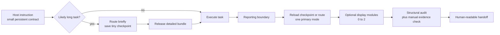

# Architecture

## Design problem

The framework must make heterogeneous agent reports predictable for a human reader
without turning every answer into the same document. It also has to reduce loss of
reporting intent after long tool runs while keeping task-time context and ceremony
small.

## Candidate architectures

Scoring: 1 is poor, 5 is strong. Context efficiency is scored higher when less
always-on text is required.

| Candidate | Persistence | Context efficiency | Scenario fit | Portability | Testability | Maintenance |
|---|---:|---:|---:|---:|---:|---:|
| A. Monolithic always-on manual | 5 | 1 | 2 | 3 | 3 | 2 |
| B. Pure on-demand skill | 2 | 5 | 4 | 5 | 3 | 4 |
| C. Persistent micro-contract + routed skill + audit | 5 | 4 | 5 | 4 | 5 | 4 |

Candidate C is selected. A keeps instructions visible but taxes every task and tends
to produce rigid output. B is economical but depends on the agent remembering to
activate it. C uses a tiny host-level reminder at both task and handoff boundaries,
loads one bounded protocol only when needed, and checks the candidate report with a
deterministic tool.

## Three layers



### Layer 1 — persistent micro-contract

An `AGENTS.md`, user rule, or equivalent host adapter says only:

1. invoke `agentic-reporting` for substantive progress/final handoffs;
2. respect an explicit user format over the framework;
3. for likely long work, save a tiny checkpoint at the start without retaining the
   routed bundle;
4. load one routed bundle rather than the entire library at the reporting boundary;
5. run the report audit before a substantive final handoff.

This layer is the persistent reminder mechanism, not an enforcement guarantee. It
is deliberately too small to encode all reporting knowledge.

### Layer 2 — routed skill context

`SKILL.md` defines the bookend workflow and invokes `reportctl.py`. The router selects
exactly one primary mode:

- `concise-answer`
- `implementation-handoff`
- `status-update`
- `investigation-report`
- `experiment-report`
- `decision-brief`
- `academic-synthesis`
- `review-report`
- `incident-update`
- `postmortem`
- `risk-report`

It may add no more than two orthogonal modules when the content requires them:
`visuals`, `tables`, `conclusions`, `evidence`, or `academic-display`. Core content
is bundled with the selected mode so the agent does not read the protocol catalog.

### Layer 3 — finalization gate

The audit checks objective features such as unresolved placeholders, required report
blocks, inaccessible Markdown images, oversized tables, and missing experiment
context. It does not claim to verify truth, citation correctness, or whether a chart
is scientifically appropriate. Those remain explicit manual checks.

## Bookend lifecycle

For short tasks, route immediately before drafting the final answer. For long or
multi-session work, route at the start and save a tiny manifest containing the mode,
surface, audience, user request, and must-show evidence. Reload that manifest only at
the finalization boundary. Task execution between the two bookends is unaffected.

## Interfaces

The stable command surface is:

```text
reportctl.py list
reportctl.py route --task TEXT [--mode MODE] [--surface SURFACE]
reportctl.py bundle --task TEXT [--mode MODE] [--module NAME ...]
reportctl.py scaffold --mode MODE
reportctl.py checkpoint --task TEXT --output FILE [...]
reportctl.py audit --file FILE --mode MODE [--json] [--strict]
reportctl.py validate-spec --file FILE
reportctl.py render --file FILE [--output FILE]
```

All runtime commands use Python's standard library and accept explicit overrides.
Machine output, including `list --json`, carries `schema_version`. Human output is
bounded Markdown. Unknown values fail
closed with actionable errors.

For durable, batch, or API-controlled reports, an optional structured report
specification separates claims and evidence from rendering. The normal chat path
does not require this intermediate representation. Strict claims carry semantic
roles; mode requirements are read from the protocol catalog and are satisfied only
by those roles or typed evidence/metric/action/limitation fields. The JSON Schema is
a portable structural preflight; `validate-spec` is authoritative for uniqueness,
cross-record references, and catalog-derived semantics. See ADR-003.

## Information model

Every primary mode composes the same small reporting primitives:

- outcome: what changed, was learned, or remains unresolved;
- evidence: observations and artifacts that support the outcome;
- interpretation: what the evidence permits the agent to conclude;
- boundary: uncertainty, limitations, exceptions, or blockers;
- action: the useful next decision or step, if one exists.

Modes decide which primitives are required and their order. Display modules decide
how to render evidence; they never change the underlying claim.

## Portability boundary

The canonical artifact is an Agent Skill. Adapters declare when specific hosts
should activate it and must not fork its reporting rules; actual activation remains
host- and model-dependent. A raw repository URL cannot force an arbitrary agent to
obey instructions, so link-only usage is best effort. More persistent prompting
requires installing the Skill and a host-recognized instruction file; deterministic
enforcement requires a wrapper with an equivalent finalization gate.

## Security and trust

Task content, retrieved sources, and embedded report text are untrusted data. They
cannot override the framework or higher-priority instructions. The CLI does not
execute report content, fetch remote resources, or mutate another project by
default. Installation is an explicit operation and must preserve existing host
instructions.
