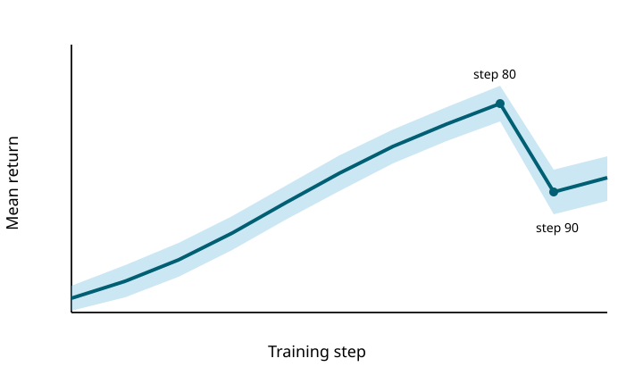

*Figure 1. Mean return over training; the shaded band is one standard deviation over five seeds.*

The curve rises through step 80 and drops at step 90. This is a verified visual observation, but the plot alone cannot identify the cause of the drop.
